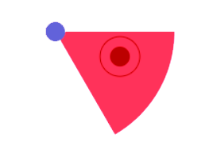

<a name="readme-top"></a>

<!-- PROJECT LOGO -->
<br />
<div align="center">
  <a href="https://github.com/adribasterra/Canvas-game">
    
  </a>

<h3 align="center"><strong>Canvas Game</strong></h3>

  <p align="center">
    Stealth game in web canvas
    <br />
    <a href="https://github.com/adribasterra/Canvas-game"><strong>Explore repository »</strong></a>
    <br />
    <br />
  </p>
</div>

<!-- TABLE OF CONTENTS -->
<details>
  <summary>Table of Contents</summary>
  <ol>
    <li>
      <a href="#about-the-project">About The Project</a>
      <ul>
        <li><a href="#built-with">Built With</a></li>
      </ul>
    </li>
    <li>
      <a href="#getting-started">Getting Started</a>
      <ul>
        <li><a href="#prerequisites">Prerequisites</a></li>
        <li><a href="#installation">Installation</a></li>
      </ul>
    </li>
  </ol>
</details>

<br>

<!-- ABOUT THE PROJECT -->

## 📌 About The Project

<div align="center">

![Product screenshot][product-screenshot]

</div>

This project was created to learn the limits of creating games in canvas and exploit the capabilities of javascript in web games. The entire game has been programmed in javascript, with a minimum percentage of pure html.

<p align="right">(<a href="#readme-top">back to top</a>)</p>

### Built With

<div align="center">

![javascript]
![html]

</div>

- **Javascript** is used as the main language
- **HTML5** is used for basic web structure and skeleton

<p align="right">(<a href="#readme-top">back to top</a>)</p>

<!-- GETTING STARTED -->

## 🔭 Getting Started

To get a local copy up and running follow these simple example steps.

### Prerequisites

Some utils need to be installed in order to use the software. This is how to install them.

- npm
  ```sh
  npm install npm@latest -g
  ```

### Installation

1. Clone the repo
   ```sh
   git clone https://github.com/adribasterra/Canvas-game.git
   ```
2. Install NPM packages
   ```sh
   npm install
   ```
3. Open project with /index.html

<p align="right">(<a href="#readme-top">back to top</a>)</p>

---

<!-- MARKDOWN LINKS & IMAGES -->

[product-screenshot]: canvas.png
[javascript]: https://img.shields.io/badge/JavaScript-323330?style=for-the-badge&logo=javascript&logoColor=F7DF1E
[html]: https://img.shields.io/badge/HTML5-E34F26?style=for-the-badge&logo=html5&logoColor=white
